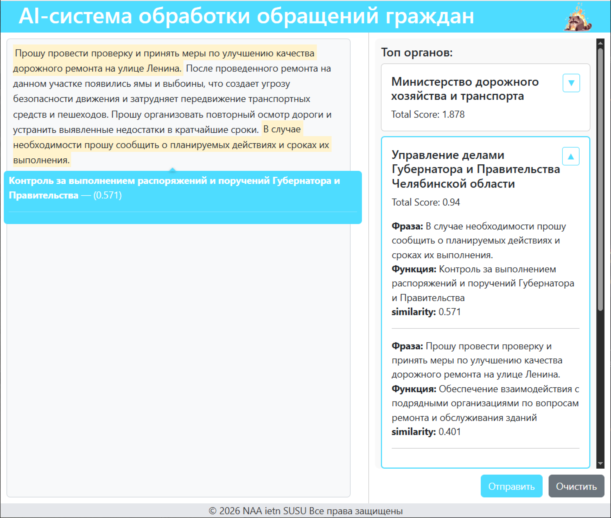
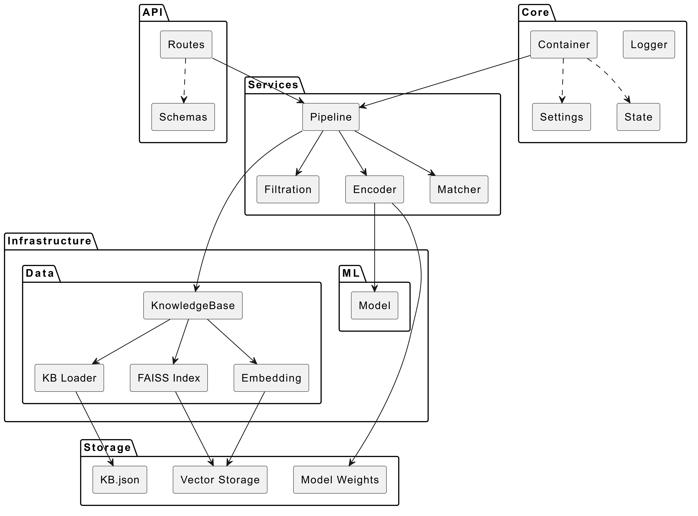
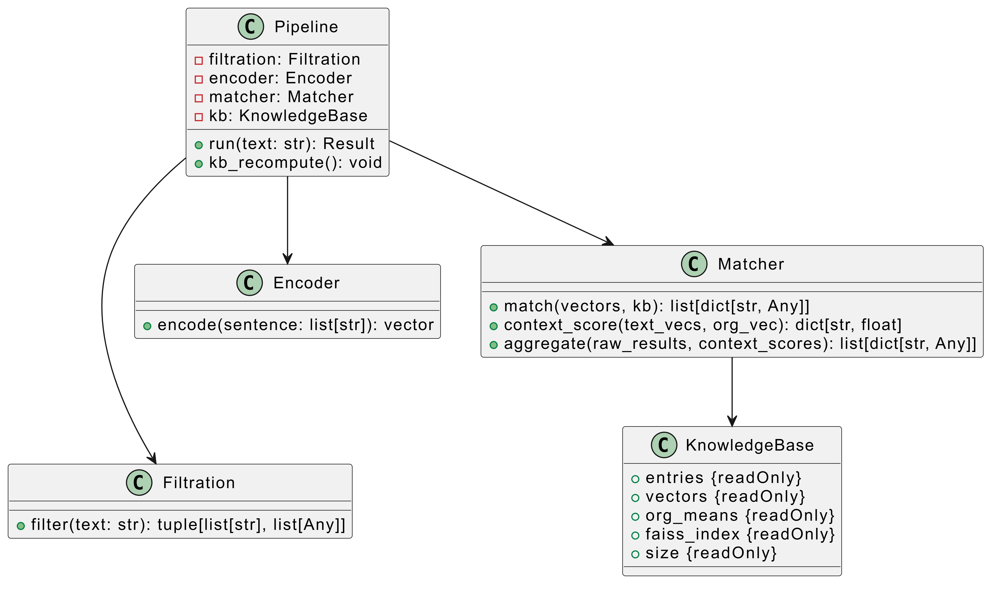
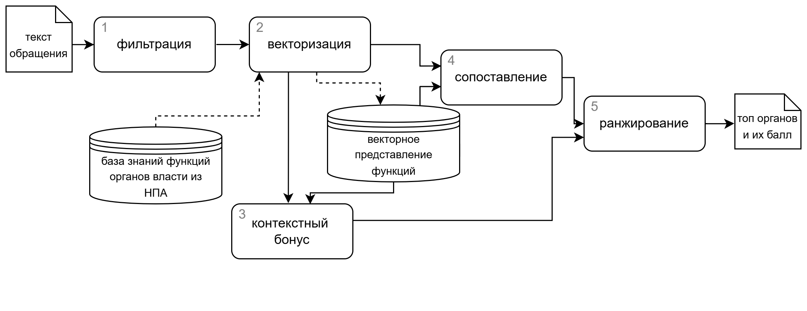
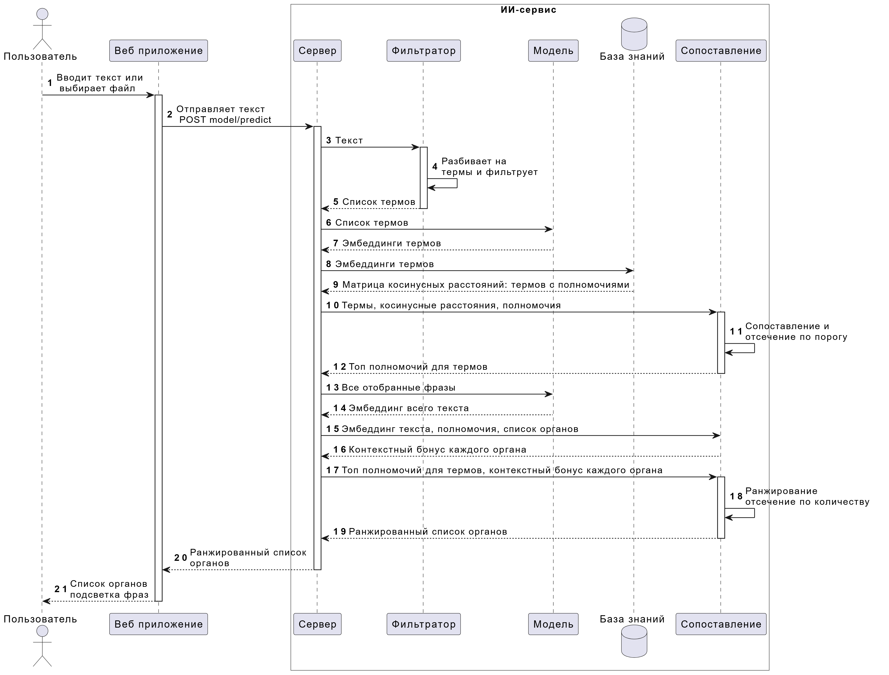
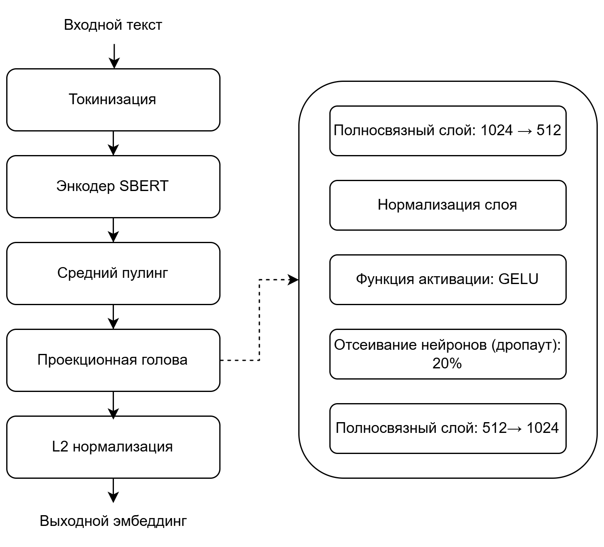

# Система объясняемого ранжирования на основе семантического поиска 
Система реализует поиск наиболее релевантных исполнителей по тексту обращения. Система реализована как AI - помощник, чтобы помогать специалистам быстрее анализировать обращения.



Система поддерживает работу с 2мя видами модели: sentence-transformer модель и torch модель.

✅ **Для работы необходимо загрузить модель в директорию model-service/model веса модели, ссылки на скачивание в файлах sent-model_path.txt и torch-model_path.txt, после соберите и поднимите docker-compose.**

Сборка:
```
docker-compose -p sys build
docker-compose -p sys up
```
Завершить работу:
```
docker-compose -p sys down
```
*Пожалуйста дождитесь уведомления* "model-service  | INFO:     Application startup complete." *Использование тяжелых библиотек приводит к долгому запуску контейнера, также после первого запуска сервер модели будет загружать модель и эмбеддинги, запуск сервиса модели может занять время из-за подсчета эмбеддингов :)*

Вес образов: model-service - 2.32 GB; frontend - 253 MB;
## Структура проекта
explicable-ranking-sys/ <br>
├── frontend/              # React приложение<br>
│   ├── Dockerfile<br>
│   ├── package.json<br>
│   └── src/<br>
├── model-service/         # FastAPI + ML модель<br>
│   ├── Dockerfile<br>
│   ├── requirements.txt<br>
│   ├── app/<br>
│   ├── knowledge/<br>
│   ├── main.py<br>
│   └── models/           # Директория для весов модели<br>
└── docker-compose.yml     # Конфигурация для запуска


## Конфигурация сервисов
### Frontend
* React приложение
* Порт: 5173

Одностраничное приложение. Слева колонка для ввода текста, справа вывод наиболее релевантных органов власти. <br>
Пример запроса на backend (в сервис модели передается в таком же виде):
```
{"text": text}
```

### Model-service
* FastAPI
* Порт 8000
* Эндпоинты:
    * post /predict - работа модели
    * post /recompute_kb - перестройка векторной базы знаний
    * get /config - запрос конфигурации модели (гиперпараметры)
    * post /config - изменение гипрепараметров модели
    * post /change_model - изменяет работу с torch модели на sentence-transformer и обратно

Получает текст и производит подготовку и векторизацию предложений. После сопоставляет с векторной базой знаний. <br>
Пример ответа:
```
200
[{'matchedPhrases': [{'function': 'Содержание и ремонт дорог областного '
                                  'значения, включая трассы и межмуниципальные '
                                  'дороги',
                      'similarity': 0.509,
                      'textPhrase': 'Машины занимают часть тротуара, чем '
                                    'мешают пешеходам.'}],
  'org': 'Министерство дорожного хозяйства и транспорта',
  'totalScore': 0.956},
 {'matchedPhrases': [{'function': 'Комплексное снижение выбросов загрязняющих '
                                  'веществ в атмосферный воздух в крупных '
                                  'промышленных центрах России, с целью '
                                  'уменьшения уровня загрязнения и улучшения '
                                  'качества воздуха',
                      'similarity': 0.428,
                      'textPhrase': 'Плюс к этому во время прогрева '
                                    'автомобилей под окнами стоит ужасная вонь '
                                    'выхлопных газов, невозможно дышать.'}],
  'org': 'Министерство экологии',
  'totalScore': 0.7}]
```
### Диаграмма классов:
<table>
  <tr>
    <td></td>
    <td></td>
  </tr>
</table>

Структура сервиса: 
* [`/models`](./model-service/model/) - папка для весов модели
* [`/knowledge`](./model-service/knowledge/) - база знаний 
    * [`kb.json`](./model-service/knowledge/kb.json) - органы власти и их функции, основная база знаний 
    * буду созданы файлы векторного хранилища и индексации 
* [`/app/api/routes`](./model-service/app/api/routes/) - эндпоинты 
* [`/app/api/schemas`](./model-service/app/api/schemas/) - pydantic модели
* [`/app/core/`](./model-service/app/core/) - файлы конфигурации
    * [`container.py`](./model-service/app/core/container.py) - инициализация компонент 
    * [`logger.py`](./model-service/app/core/logger.py) - логгер приложения
    * [`settings.py`](./model-service/app/core/settings.py) - пути до файлов
    * [`state.py`](./model-service/app/core/state.py) - гиперпараметры сервиса
* [`/app/infrastructure/data/`](./model-service/app/infrastructure/data/) - работа с базой знаний
    * [`embedding.py`](./model-service/app/infrastructure/data/embedding.py) - векторизация текста
    * [`faiss_index.py`](./model-service/app/infrastructure/data/faiss_index.py) - управление faiss индексации
    * [`kb.py`](./model-service/app/infrastructure/data/kb.py) - основной класс для работы с базой знаний
    * [`kb_loader.py`](./model-service/app/infrastructure/data/kb_loader.py) - загрузчик базы знаний
* [`/app/infrastructure/ml/`](./model-service/app/infrastructure/ml/) - архитектура PyTorch модели
* [`/app/services`](./model-service/app/services/) - код модулей 
    * [`encoder.py`](./model-service/app/services/encoder.py) - векторизация через модель в  models
    * [`filtration.py`](./model-service/app/services/filtration.py) - алгоритмическая фильтрация предложений
    * [`matcher.py`](./model-service/app/services/matcher.py) - модуль постобработки 
    * [`pipeline.py`](./model-service/app/services/pipeline.py) - собирает работу всех модулей и готовит ответ

## Алгоритма ИИ обработки:



Диаграмма последовательностей: 



### Гиперпараметры
* topKOrg - сколько исполнителей будет выведено 
* topKFunc - сколько ближайших функций для каждого предложения будет максимально взято
* threshold - [-1, 1] порог косинусного подобия по которому будут отбираться релевантные пары предложения - функция
* torch_model - флаг указывающий используется ли torch модель

## Модель векторизации
Схема:



Скрипт обучения модели:
[`training_script.ipynb`](./training_script.ipynb)

---
*Требования к по: ну у меня на i3-12100 с 16 Гб RAM пытается работать*

*Автор только учится писать нормальный код :)*